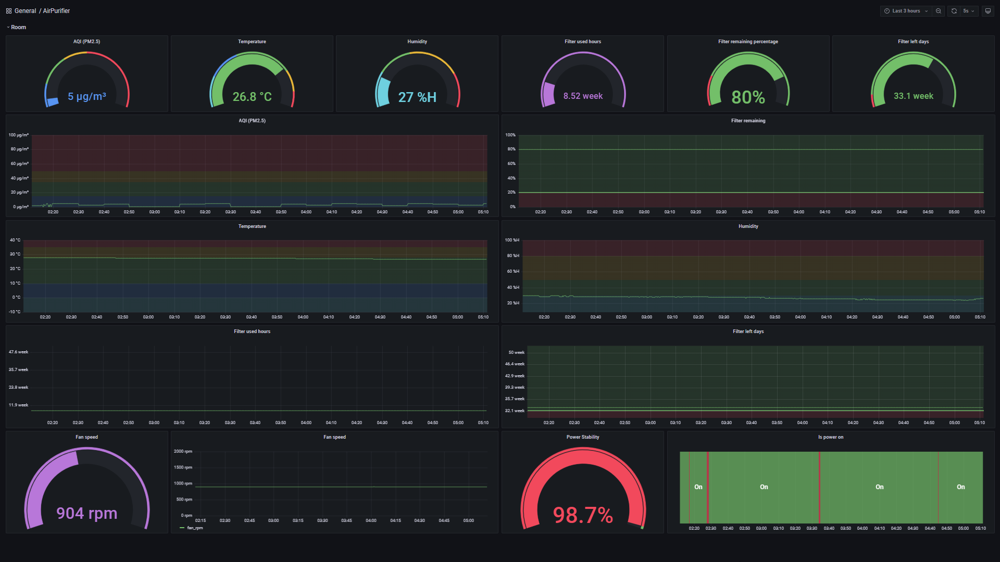

# Prometheus exporter for Xiaomi Air Purifier MIOT varient



## Get device token
Use instructions: [https://github.com/jghaanstra/com.xiaomi-miio/blob/master/docs/obtain_token.md](https://github.com/jghaanstra/com.xiaomi-miio/blob/master/docs/obtain_token.md)

Or just install patched app: [http://www.kapiba.ru/2017/11/mi-home.html](http://www.kapiba.ru/2017/11/mi-home.html)

## `--model` Argument.
Use `--model` argument for pass unsupported model treat as another model.

ex) Air Purifier 4 with `--model zhimi.airp.va2` (Air Purifier 4 Pro. It's completely compatible with 4 series but miio 0.5.x supports only 4 Pro.)

## Run with command-line
```bash
# install dependencies
python -m pip install -r requirements.txt

# run server
python ./run_server.py --ip xx.xx.xx.xx --token xxxxxxxx --port 8000

# if miio doesn't support your model, try override
python ./run_server.py --ip xx.xx.xx.xx --token xxxxxxxx --port 8000 --model zhimi.airp.va2
```

## Run with Docker
```bash
docker run -d --name prometheus_humidifier -p 8000:8000 -e "TOKEN=xxxxxxxx" -e "IP=xx.xx.xx.xx" mpthlee/prometheus_airpurifier_miot_exporter
```
Doesn't work with `--model` argument.

## Container registry
[](https://hub.docker.com/r/mpthlee/prometheus_airpurifier_miot_exporter)


[https://hub.docker.com/r/mpthlee/prometheus_airpurifier_miot_exporter](https://hub.docker.com/r/mpthlee/prometheus_airpurifier_miot_exporter)\
[https://ghcr.io/mpthlee/prometheus_airpurifier_miot_exporter](https://ghcr.io/mpthlee/prometheus_airpurifier_miot_exporter)
